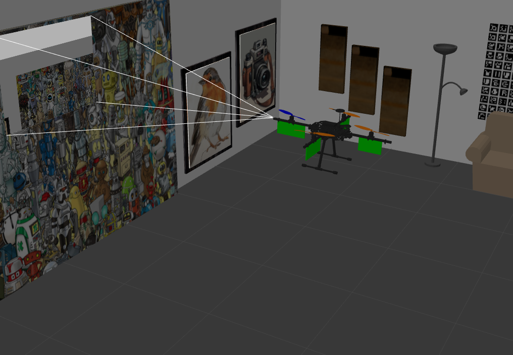

# PBVS_FA

# **About this work**  

This project presents the results of **Software-in-the-Loop (SITL)** simulations in **Gazebo**, validating the effectiveness of the proposed controller for **Position-Based Visual Servoing (PBVS)** in fully actuated UAVs. The controller ensures accurate tracking of velocity references generated by PBVS while maintaining stability under various conditions. Additionally, the integration of homography-based visual control further enhances precision in vision-based UAV navigation.



---

# **How to Run the Program**  

## **Prerequisites**  

Before running the program, make sure you have **PX4** installed by following the official guide:  
🔗 [PX4 Installation Guide](https://docs.px4.io/main/en/dev_setup/building_px4.html)  

## **Setup**  

1. Download the package from this repository.  
2. Create a **workspace** and move into the `src` folder:  

   ```bash
   mkdir -p ~/catkin_ws/src
   cd ~/catkin_ws/src
   ```

3. Copy the package into the `src` directory.  
4. Compile the workspace:  

   ```bash
   cd ~/catkin_ws
   catkin_make
   ```

5. Set up the environment by running the following commands:  

   ```bash
   source devel/setup.bash
   source ~/PX4-Autopilot/Tools/simulation/gazebo-classic/setup_gazebo.bash ~/PX4-Autopilot ~/PX4-Autopilot/build/px4_sitl_default
   export ROS_PACKAGE_PATH=$ROS_PACKAGE_PATH:~/PX4-Autopilot
   export ROS_PACKAGE_PATH=$ROS_PACKAGE_PATH:~/PX4-Autopilot/Tools/simulation/gazebo-classic/sitl_gazebo-classic
   export GAZEBO_PLUGIN_PATH=$GAZEBO_PLUGIN_PATH:/usr/lib/x86_64-linux-gnu/gazebo-11/plugins
   ```

## **Run the Simulation**  

To start the simulation in **ROS Noetic**, execute the following command:  

```bash
roslaunch offboard start_offb.launch
```

---  

This program was developed and tested in **ROS 1 Noetic**. 🚀


<p align="center">
  
</p>

watch the following video:
https://www.youtube.com/watch?v=EHMxuQv3gU8
